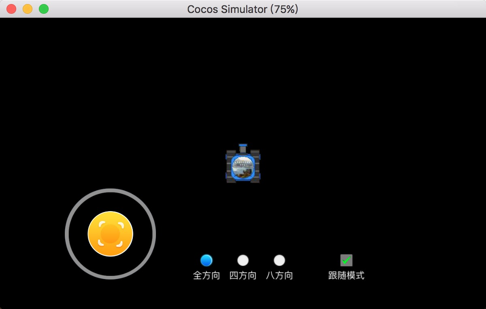
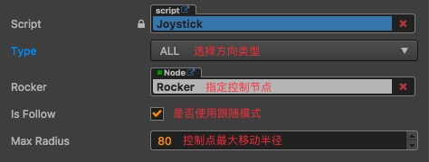
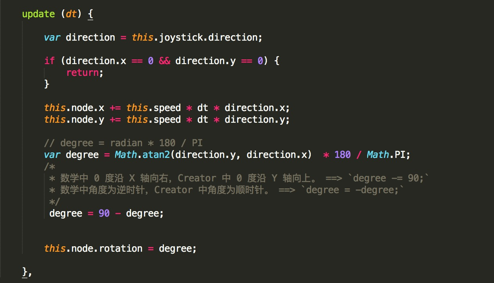

# Joystick
Cocos Creator 游戏摇杆（全方向、四方形、八方向、跟随模式）。



## Feature
* 多类型选择（全方向、四方形、八方向）
* 跟随模式

## Usage

步骤：

0. 拷贝 Joystick.js 文件到您的项目中，并作为用户脚本组件添加到您项目的摇杆节点。
0. 根据项目需求指定 Joystick 组件的属性。<br/>

0. 通过摇杆控制角色，具体查看[Tank.js](./assets/scripts/Tank.js)。


**具体使用方法请下载本项目在 Cocos Creator 中查看。**

### 动态修改摇杆类型

**方式1（代码修改）：**

```
var Joystick = require('Joystick');

// 省略代码，有 Joystick 组件实例（命名 joystick ）。

this.joystick.setType(Joystick.Type.ALL);
```

**方式2（编辑器指定事件回调函数）：**

Joystick 组件中已编写了函数作为事件回调，在编辑器中直接使用即可。

回调函数：`setTypeAsAll()` `setTypeAsFour()` `setTypeAsEight()`

### 动态修改是否使用跟随模式

**方式1（代码指定）：**

```
var Joystick = require('Joystick');

// 省略代码，有 Joystick 组件实例（命名 joystick ）。

var isFollow = true; // or false
this.joystick.setFollow (isFollow);
```

**方式2（编辑器指定事件回调函数）：**

Joystick 组件中已编写了 `toggleFollow()` 函数作为事件回调，在编辑器中直接使用即可。
